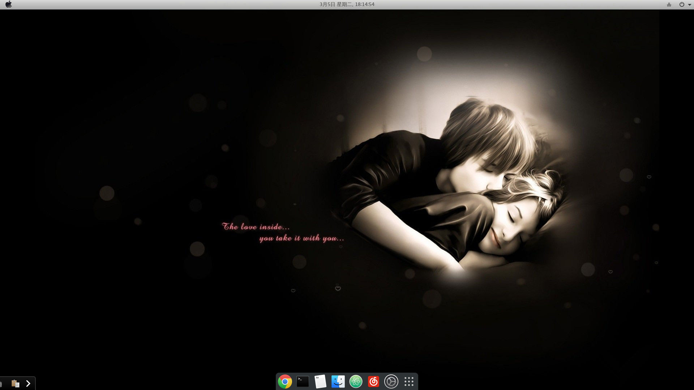

hexo博客插入图片Reprint
lol
Set post_asset_folder in the home page configuration file _config.yml: this option is set to true (if you don't have it, don't worry)

In the cmd your hello directory, execute this sentence npm install hexo-asset-image –save, this is to download and install a plugin that can upload local images.

After the installation is complete, when you run hexo n "title" to generate the md blog post, the /source/_posts folder has a folder with the same name in addition to the title.md file.

When importing images in title.md, first copy the images into the title folder, and then just import the images in the markdown format in title.md



Reprint
``` c
int main(){
  return main();
}
```
